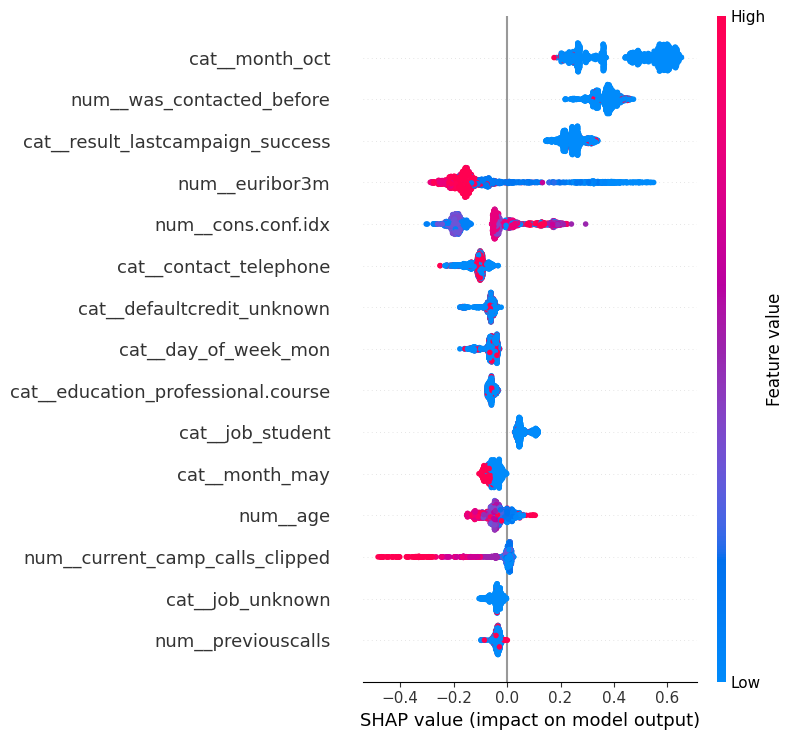

# Прогнозування підписки на строковий депозит (Bank Marketing)

## Опис задачі

Банк проводив телефонну маркетингову кампанію, пропонуючи клієнтам відкрити строковий депозит. Мета проєкту — побудувати модель машинного навчання, яка передбачає ймовірність того, що клієнт погодиться на пропозицію (`y = yes/no`), на основі демографічних, поведінкових та макроекономічних ознак.

Датасет містить ≈41 000 записів після очищення (видалено 12 технічних дублів), 21 вихідну ознаку. Цільова змінна має виражений дисбаланс класів: ≈11.3% "yes" проти ≈88.7% "no".

**Бізнес-цінність:** модель дозволяє банку пріоритизувати дзвінки клієнтам з найвищою ймовірністю згоди, підвищуючи ефективність кампанії та скорочуючи витрати call-центру на дзвінки з низькою конверсією.

## Що було зроблено

### 1. Розвідувальний аналіз даних (EDA)
- Видалення технічних дублів (12 записів)
- Аналіз прихованих пропусків `'unknown'` — детальна перевірка `defaultcredit` (≈21% unknown), підтверджено інформативність категорії
- Виявлення сильно скошених ознак (`current_camp_calls`, `previouscalls`, `duration`) та клипінг викидів по 99-му перцентилю
- Виявлення найсильніших предикторів: `result_lastcampaign`, `contact`, `month`, `euribor3m`, `emp.var.rate`
- Виявлення критичної мультиколінеарності макроекономічних ознак

### 2. Feature engineering
- `was_contacted_before` — бінарний прапорець замість спеціального коду 999 у `days_after_lastcontact`
- `current_camp_calls_clipped` — клипінг викидів по 99-му перцентилю (розрахований на train, без data leakage)
- Виключено `duration` (data leakage) та мультиколінеарні макропоказники

### 3. Препроцесинг
- Train/test split (80/20, стратифікований за `y`)
- `ColumnTransformer`: `StandardScaler` для лінійних моделей, `OneHotEncoder(drop='first')` для категоріальних ознак
- Окремі pipeline для лінійних моделей (зі скейлінгом) та деревоподібних (без скейлінгу)

### 4. Моделювання
Навчено та порівняно 4 типи моделей із крос-валідацією (5 fold):
- **Logistic Regression** (`class_weight='balanced'`)
- **kNN** (`n_neighbors=5`)
- **Decision Tree** (`class_weight='balanced', max_depth=5`)
- **XGBoost** (`scale_pos_weight` для балансування класів)

Для XGBoost проведено тюнінг гіперпараметрів двома способами (30 ітерацій кожен):
- **RandomizedSearchCV** (sklearn)
- **Hyperopt** (Bayesian Optimization / TPE)

### 5. Інтерпретація моделі
- Feature importance для фінальної моделі (XGBoost + Hyperopt)
- SHAP-аналіз (`TreeExplainer`) для оцінки напрямку та сили впливу ознак
- Аналіз помилок (False Positive / False Negative) на test-вибірці

## Результати експериментів

**Пріоритетні метрики:** з огляду на бізнес-логіку (вартість пропущеного клієнта суттєво вища за вартість одного зайвого дзвінка), **Recall та F2-score є пріоритетнішими за Precision** — модель повинна знаходити максимум реальних потенційних клієнтів, навіть ціною більшої кількості хибних спрацьовувань.

### Порівняння базових моделей (валідація, CV mean)

| Модель | Гіперпараметри | F1 | **F2** | Precision | **Recall** | ROC-AUC | PR-AUC |
|---|---|---|---|---|---|---|---|
| Logistic Regression | `class_weight='balanced', max_iter=1000` | 0.431 | 0.533 | 0.327 | **0.633** | 0.788 | 0.429 |
| kNN | `n_neighbors=5` | 0.362 | 0.303 | 0.534 | 0.274 | 0.718 | 0.316 |
| Decision Tree | `class_weight='balanced', max_depth=5` | 0.453 | 0.537 | 0.359 | 0.613 | 0.779 | 0.404 |
| XGBoost (базовий) | `n_estimators=100, max_depth=4, learning_rate=0.1` | 0.460 | 0.551 | 0.361 | **0.635** | 0.798 | 0.463 |

*kNN одразу виключений з розгляду — найнижчий recall (0.274) означає, що модель пропускає майже 3 з 4 реальних клієнтів, що критично невигідно для банку.*

### Тюнінг гіперпараметрів XGBoost (валідація, CV mean)

| Модель | Гіперпараметри | F1 | **F2** | Precision | **Recall** | PR-AUC |
|---|---|---|---|---|---|---|
| XGBoost (базовий) | `n_estimators=100, max_depth=4, lr=0.1` | 0.460 | 0.551 | 0.361 | 0.635 | 0.463 |
| XGBoost + RandomizedSearch | `n_estimators=335, max_depth=5, lr=0.04, subsample=0.95, colsample_bytree=0.85` | 0.465 | 0.549 | 0.370 | 0.625 | 0.466 |
| **XGBoost + Hyperopt** ⭐ | `n_estimators=161, max_depth=7, lr=0.011, colsample_bytree=0.60, subsample=0.82` | **0.480** | **0.556** | 0.391 | 0.622 | **0.469** |

*Незважаючи на дуже близькі значення Recall між трьома версіями (0.62–0.64), Hyperopt обрано як фінальну модель через найкращий баланс F1/F2/PR-AUC при поміркованому перенавчанні.*

### Фінальна оцінка на test-вибірці (XGBoost + Hyperopt, 8236 спостережень)

| Метрика | Значення |
|---|---|
| F1 | 0.502 |
| Precision | 0.410 |
| **Recall** | **0.648** |
| ROC-AUC | 0.815 |
| PR-AUC | 0.484 |

**Матриця помилок (test):** TP=601, TN=6442, FP=866, FN=327

**Інтерпретація:** модель знаходить **64.8% усіх реальних потенційних клієнтів** (recall). Із 928 клієнтів, які реально погодилися б на депозит, модель пропускає 327 (35.2%) — саме на зменшення цього показника варто спрямувати подальші покращення (див. рекомендації нижче).

## Основні графіки


*Дисбаланс класів: ≈11.3% "yes" проти ≈88.7% "no"*


*Мультиколінеарність макроекономічних ознак (emp.var.rate, euribor3m, nr.employed — кореляція до 0.97)*


*Топ-15 найважливіших ознак фінальної моделі*



*Напрямок і сила впливу ознак на передбачення*

## Найважливіші ознаки (SHAP + Feature Importance)

1. **`was_contacted_before`** — наявність попереднього контакту з клієнтом
2. **`result_lastcampaign_success`** — успіх попередньої кампанії
3. **`euribor3m`** — макроекономічний індикатор (тримісячна міжбанківська ставка)
4. **`cons.conf.idx`** — індекс споживчої довіри
5. **`month`** (сезонність) — особливо `october`, `march`, `december`

Пріоритет ознак узгоджується з бізнес-логікою: історія взаємодії з клієнтом та макроекономічний контекст є найсильнішими предикторами згоди на депозит.

## Аналіз помилок

- **False Negative (327, 4.0% test)** — модель систематично пропускає клієнтів **без** історії попередніх контактів (`was_contacted_before=0` у 100% таких випадків), які тим не менш погоджуються.
- **False Positive (866)** — дзеркальна ситуація: клієнти з "типовими" ознаками yes (низький `euribor3m`, є контакт раніше), які реально відмовляються.
- Обидва типи помилок пов'язані з надмірною залежністю моделі від двох домінантних ознак.

## Висновки

**Чого досягнуто:**
- Побудовано модель з Recall=0.648 та F2=0.556 на test — модель знаходить майже дві третини реальних потенційних клієнтів
- Hyperopt (Bayesian Optimization) дав найкращий баланс F1/F2/PR-AUC серед варіантів тюнінгу при поміркованому перенавчанні
- SHAP-аналіз підтвердив, що модель спирається на бізнес-логічні ознаки, що відповідає common sense
- Аналіз помилок виявив конкретний, дієвий патерн: 100% False Negative — клієнти без попереднього контакту (`was_contacted_before=0`)

**Що можна покращити (з фокусом на Recall/F2, оскільки пропущений клієнт коштовніший за зайвий дзвінок):**

1. **Знизити поріг класифікації нижче 0.5** — головна рекомендація. Оскільки вартість зайвого дзвінка (False Positive) є мінімальною порівняно з втратою потенційного клієнта (False Negative), доцільно явно оптимізувати поріг класифікації під максимізацію Recall/F2 замість стандартного порогу 0.5, підібраного через Precision-Recall curve на train/validation.
2. **Переоптимізувати тюнінг гіперпараметрів під F2 замість F1** — в поточній роботі RandomizedSearch і Hyperopt оптимізували F1 як компромісну метрику. Повторний тюнінг зі `scoring='f2'` (або кастомною метрикою з вагою на recall) імовірно дасть ще вищий recall без значної втрати якості.
3. **Створити ознаки-взаємодії** (`was_contacted_before × result_lastcampaign`) — оскільки 100% False Negative припадають на клієнтів без `was_contacted_before=1`, модель потребує додаткових сигналів для розпізнавання "нетипових" зацікавлених клієнтів саме в цій групі.
4. **Розглянути ансамбль з різними порогами для різних сегментів** — наприклад, нижчий поріг класифікації спеціально для клієнтів без попереднього контакту (де зараз найбільше пропусків).
5. **Додати ознаки про зміст дзвінка** (тон розмови, тип запропонованого продукту) — потенційно найкраще пояснення нетипових випадків.
6. **Провести калібрування ймовірностей** (`CalibratedClassifierCV`) для стабільнішого підбору порогу.
7. Спробувати LightGBM/CatBoost для порівняння з XGBoost.

**Бізнес-рекомендація:** з огляду на асиметричну вартість помилок (втрачений клієнт >> зайвий дзвінок), рекомендується використовувати модель з **пониженим порогом класифікації** (напр. 0.3 замість 0.5), що дозволить суттєво підвищити recall навіть ціною більшої кількості False Positive — фінансово це вигідніше для банку, ніж поточний баланс.

## Дані

Використано датасет **Bank Marketing** (UCI Machine Learning Repository).

## Технології

Python, pandas, scikit-learn, XGBoost, Hyperopt, SHAP, Plotly, Matplotlib, Seaborn

## Структура репозиторію

```
├── notebooks/
│   └── bank_marketing_analysis.ipynb
├── Images/
│   ├── Class inbalance .png
│   ├── Correlation matrix.png
│   ├── SHAP.png
│   └── feature importance.png
├── README.md
└── requirements.txt
```
